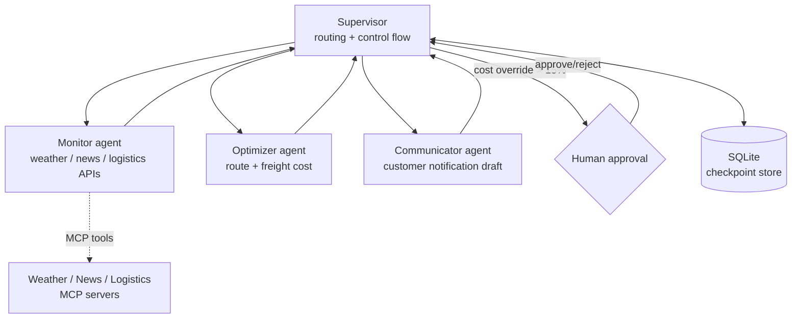

# Supply-chain Agent Orchestrator — Technical Documentation

> **Living document.** This is the authoritative technical reference for the system. It **must** be updated in the same change set as any modification that alters the architecture, adds or removes an agent or component, changes an interface or state schema, changes the persistence model, or changes the deployment topology. Record every such change in the [Revision history](#12-revision-history).

| | |
|---|---|
| **Status** | Draft — pre-implementation |
| **Owner** | Vijay Ananth Karunanithi |
| **Last updated** | 2026-07-07 |
| **Version** | 0.1.0 |

---

## 1. Overview

A multi-agent system that responds to supply-chain disruptions (customs delays, weather, strikes, news events) for a set of active shipping routes. A network of role-specialized agents monitors external signals, recomputes routing and freight cost, drafts customer notifications, and escalates to a human when a cost override exceeds a configured threshold (default 15%). State is persisted so a run can pause for human approval and resume.

The orchestrator is implemented in **LangGraph** (production path) and re-implemented in **CrewAI** (comparison) to produce a hands-on, numbers-backed framework evaluation.

## 2. Goals and non-goals

**Goals**
- Detect disruptions affecting active routes and react with low latency.
- Recompute route/cost options and draft customer communications automatically.
- Enforce human-in-the-loop approval above the cost-override threshold.
- Durable state with pause/resume semantics.
- A defensible LangGraph-vs-CrewAI comparison as a first-class deliverable.

**Non-goals**
- Executing real bookings or sending real customer messages (drafting only; sending is gated).
- Replacing a logistics operator's final judgment on expensive overrides.

## 3. System architecture

## 4. Component design

### 4.1 Agents
- **Monitor** — polls external APIs (exposed as MCP servers) for signals affecting active routes.
- **Optimizer** — recomputes candidate paths and dynamic freight pricing on a detected change.
- **Communicator** — drafts a customer notification, adapting tone to the customer segment. Output is validated; sending is out of scope and gated.
- **Supervisor** — directs control flow from shared state and triggers the human-approval interrupt.

### 4.2 Orchestration frameworks
- **LangGraph (production):** explicit stateful graph with cycles, checkpointing, and interrupts. Chosen because durable, cyclic, human-in-the-loop control flow is its core competency.
- **CrewAI (comparison):** the same four-role workflow expressed as a crew, scoped to the comparison scenario. See [ADR-0002](adr/0002-orchestration-framework.md).

### 4.3 Tools and protocols
- External data sources are **MCP servers**, making them reusable and swappable. Mock providers are used when API keys are absent.
- **A2A** is noted as the direction for inter-agent messaging; not yet integrated.

## 5. State and persistence

- **Checkpoint store:** SQLite (`orchestrator.sqlite`), holding the serialized graph state per thread to support pause/resume across a human-approval interrupt.
- State schema includes: active routes, detected disruptions, candidate route/cost options, pending approvals, and message drafts. Schema changes require a revision-history entry.
- Migration path to Postgres (Cloud SQL) documented under deployment.

## 6. Interface

- **CLI** entry point (`supplyagents.simulate`) that injects simulated disruption scenarios and prints agent outputs and supervisor routing.
- Programmatic API surface is the graph invocation with a thread id for resumption.

## 7. Safety and guardrails

- **Action-scope allowlist (least privilege):** agents may draft but not send; may propose re-routes but may not exceed the cost-override threshold without human approval.
- Output validation on all customer-facing text.
- The `human_approval_threshold` (default 0.15) is configuration, pinned by test.

## 8. Framework comparison (deliverable)

A written benchmark of LangGraph vs CrewAI on the identical workflow, covering: implementation effort, control granularity over the state machine, handling of the human-in-the-loop interrupt, and token cost. Results recorded here on completion.

## 9. Deployment and infrastructure

- **Local:** Docker.
- **Cloud:** GCP — Cloud Run, or GKE for the stateful supervisor; checkpoint store migrated to Cloud SQL.
- **CI/CD:** GitHub Actions — lint and test.

## 10. Observability

- **LangSmith / Langfuse** tracing: per-agent decision path, latency, and token cost per run.

## 11. Build roadmap

1. LangGraph orchestrator + supervisor routing.
2. SQLite checkpointing + human-in-the-loop resume.
3. MCP tool servers (weather / news / logistics).
4. Action guardrails.
5. CrewAI re-implementation.
6. Written LangGraph-vs-CrewAI benchmark.
7. Simulation CLI + GCP deployment.

## 12. Revision history

| Date | Version | Change | Author |
|---|---|---|---|
| 2026-07-07 | 0.1.0 | Initial technical documentation (pre-implementation). | Vijay Ananth Karunanithi |
